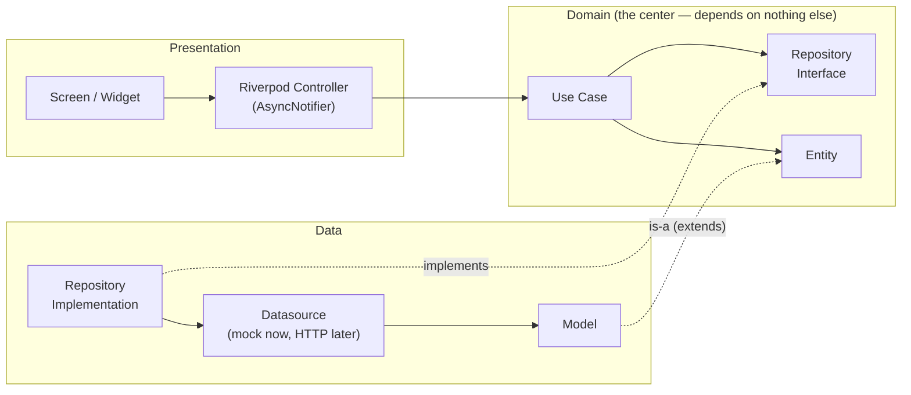
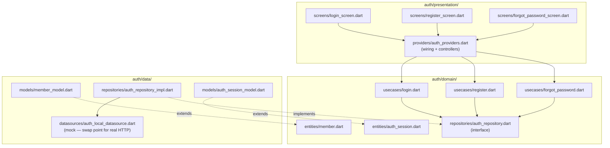
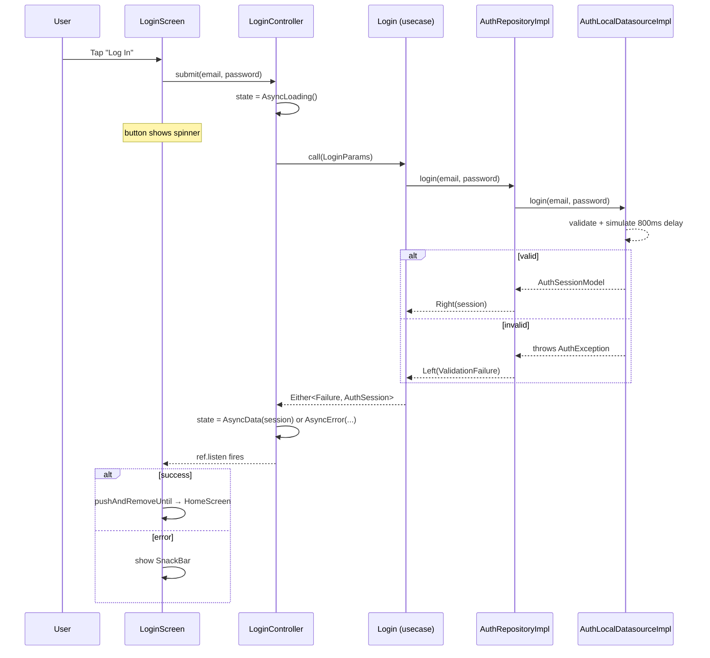
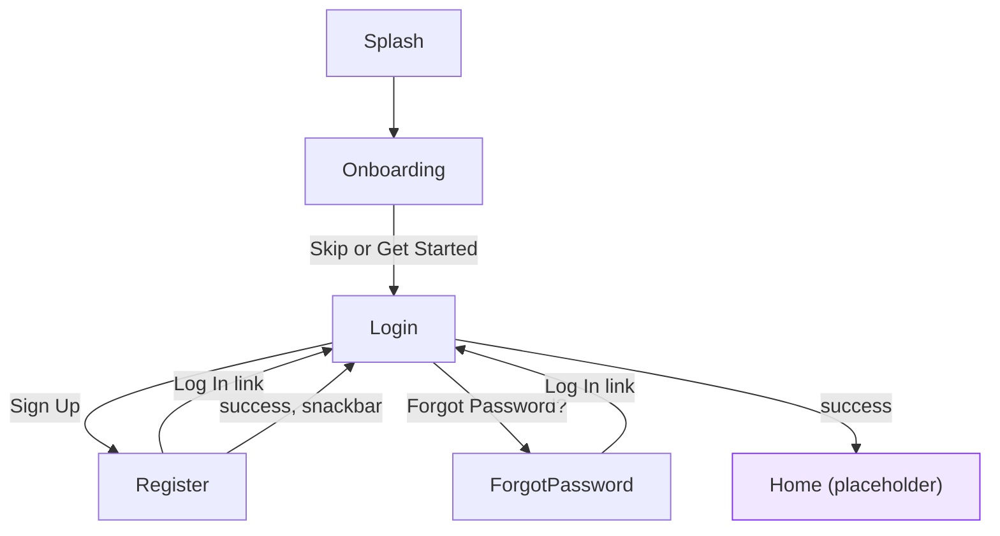

# Libra — Architecture Reference

A living doc explaining **how** the pieces we've built actually connect at runtime. `plan.md` tracks what to build next; this tracks how what's already built works, updated each time a feature gets wired.

---

## 1. The generic pattern (every feature follows this)

Every feature's three layers, and the direction dependencies point — always inward, toward `domain`. `domain` never imports from `data` or `presentation`.

**Why the arrow from `RepoImpl` to `RepoInterface` is dotted ("implements")**: this is the one inversion that makes the whole thing swappable. `domain` defines *what* operations exist (the interface); `data` decides *how* to fulfill them. Swapping the mock datasource for real HTTP later means editing `data/`, never `domain/` or `presentation/`.

---

## 2. Feature: `auth` (built)

### Structure

### Runtime flow — tapping "Log In"

Register and Forgot Password follow the identical shape (`RegisterController`, `ForgotPasswordController`) — only what happens on success differs: Register pops back to Login with a snackbar (no auto-login, per the backend contract); Forgot Password shows the generic confirmation and stays put (anti-enumeration rule).

---

## 3. Screen navigation flow (built so far)

`Splash → Onboarding → Login` and `Login → Home` use `pushReplacement`/`pushAndRemoveUntil` (one-way, can't navigate back). `Login ↔ Register` and `Login ↔ ForgotPassword` use `push`/`pop` (siblings — legitimately reversible). See [plan.md §8-9](plan.md) for why.

---

## 4. Decisions log

**2026-09-09 — Entities are per-feature, not shared.** `auth`'s `Member` (id, fullName, email, phone) is intentionally a different class from what the future `members` feature will use for the full profile — they represent different bounded contexts (authenticated identity vs. editable profile) even though the fields overlap. Same plan for `books`' full `Book` vs. `borrowings`' tiny embedded `BorrowingBook` — matches how the backend itself scopes each endpoint's response.

Worth knowing: this follows the *community* Clean Architecture pattern (same as `CleanArchitectureDemo`, our reference repo) — Google's own [official architecture guide](https://docs.flutter.dev/app-architecture/guide) actually recommends the opposite (one shared `domain/models/` folder, repositories kept independent of *each other* but not of the model). We're deliberately staying consistent with `CleanArchitectureDemo` since that's our chosen reference; flagged here in case that tradeoff needs revisiting later.

---

## How to keep this updated

Each time a new feature gets wired (domain + data + presentation, not just UI screens):
1. Add a `## Feature: <name>` section with its structure diagram (copy §2's shape).
2. Add a sequence diagram for its main action if the flow differs meaningfully from `auth`'s.
3. Extend the navigation flowchart in §3 if it adds new screens/transitions.
4. Log any non-obvious architectural decision in §4, dated.
