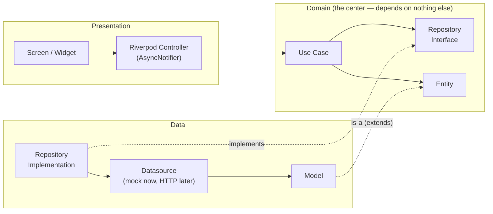
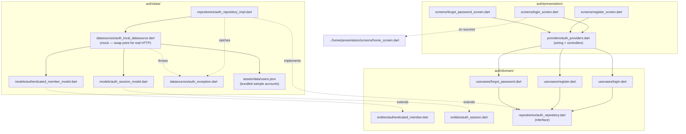
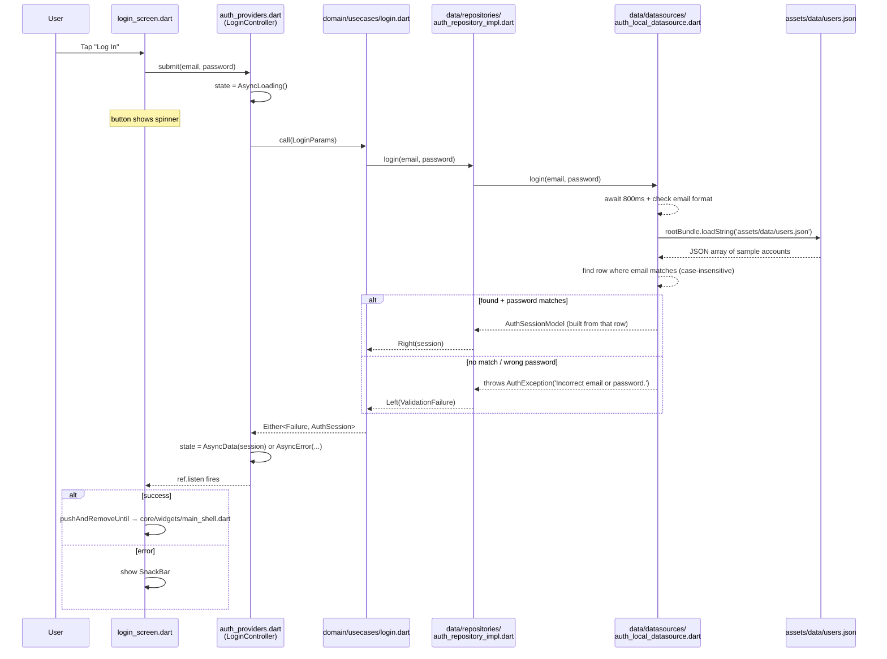
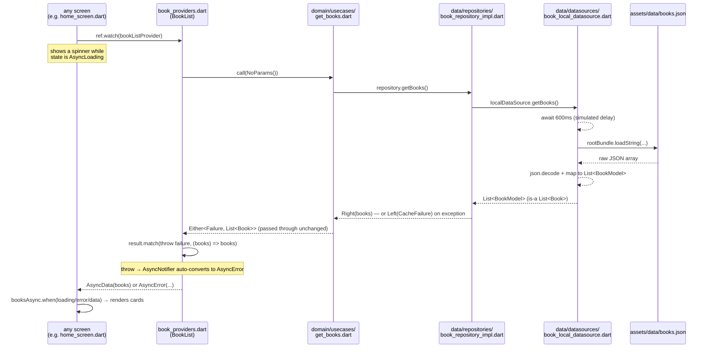
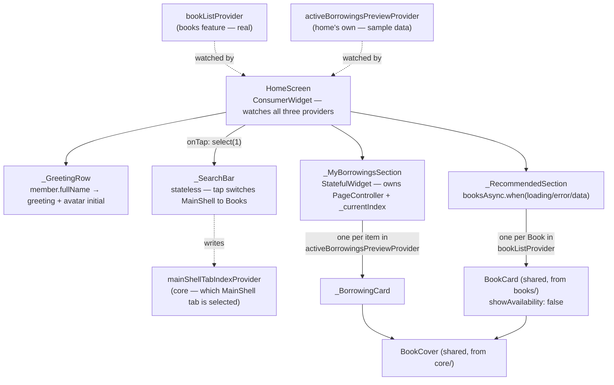
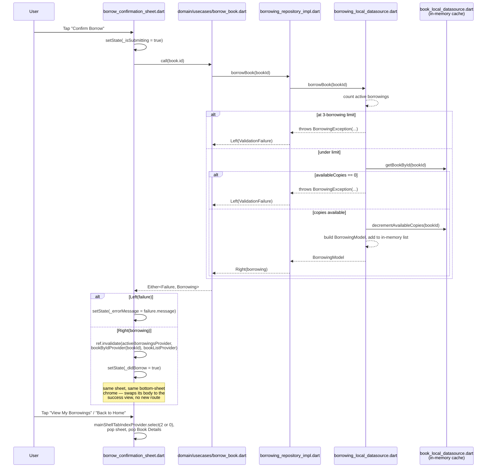
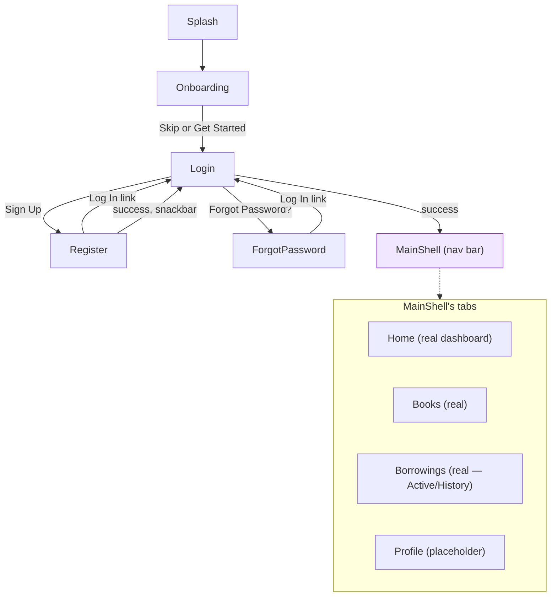

# Libra — Architecture Reference

A living doc explaining **how** the pieces we've built actually connect at runtime. `plan.md` tracks what to build next; this tracks how what's already built works, updated each time a feature gets wired.

---

## 1. The generic pattern (every feature follows this)

Every feature's three layers, and the direction dependencies point — always inward, toward `domain`. `domain` never imports from `data` or `presentation`.

**Why the arrow from `RepoImpl` to `RepoInterface` is dotted ("implements")**: this is the one inversion that makes the whole thing swappable. `domain` defines *what* operations exist (the interface); `data` decides *how* to fulfill them. Swapping the mock datasource for real HTTP later means editing `data/`, never `domain/` or `presentation/`.

---

## 2. Feature: `auth` (built)

### Files involved, and what each one does

| File | Layer | Job |
|---|---|---|
| [`domain/entities/authenticated_member.dart`](lib/features/auth/domain/entities/authenticated_member.dart) | domain | `AuthenticatedMember` — pure data class (id, fullName, email only) |
| [`domain/entities/auth_session.dart`](lib/features/auth/domain/entities/auth_session.dart) | domain | `AuthSession` — tokens + `AuthenticatedMember` |
| [`domain/repositories/auth_repository.dart`](lib/features/auth/domain/repositories/auth_repository.dart) | domain | `AuthRepository` — the interface/contract; declares `login`/`register`/`forgotPassword`, no implementation |
| [`domain/usecases/login.dart`](lib/features/auth/domain/usecases/login.dart) | domain | `Login` — calls `repository.login(...)`, nothing else |
| [`domain/usecases/register.dart`](lib/features/auth/domain/usecases/register.dart) | domain | `Register` — calls `repository.register(...)` |
| [`domain/usecases/forgot_password.dart`](lib/features/auth/domain/usecases/forgot_password.dart) | domain | `ForgotPassword` — calls `repository.forgotPassword(...)` |
| [`data/models/authenticated_member_model.dart`](lib/features/auth/data/models/authenticated_member_model.dart) | data | `AuthenticatedMemberModel extends AuthenticatedMember` — adds `fromJson` |
| [`data/models/auth_session_model.dart`](lib/features/auth/data/models/auth_session_model.dart) | data | `AuthSessionModel extends AuthSession` — adds `fromJson` |
| [`data/datasources/auth_exception.dart`](lib/features/auth/data/datasources/auth_exception.dart) | data | `AuthException` — thrown by the datasource, caught by the repository |
| [`data/datasources/auth_local_datasource.dart`](lib/features/auth/data/datasources/auth_local_datasource.dart) | data | `AuthLocalDatasourceImpl` — **the mock**. Reads `assets/data/users.json`, checks email+password against it, simulates an 800ms delay. This is the one file that gets replaced by a real HTTP datasource later |
| [`assets/data/users.json`](assets/data/users.json) | data (asset, not code) | Sample accounts `AuthLocalDatasourceImpl` reads and matches against — same pattern as `CleanArchitectureDemo`'s `assets/data/books.json` |
| [`data/repositories/auth_repository_impl.dart`](lib/features/auth/data/repositories/auth_repository_impl.dart) | data | `AuthRepositoryImpl implements AuthRepository` — calls the datasource, catches `AuthException`, converts to `Failure` |
| [`presentation/providers/auth_providers.dart`](lib/features/auth/presentation/providers/auth_providers.dart) | presentation | Wires datasource → repository → use cases (`Provider`s), plus `LoginController`/`RegisterController`/`ForgotPasswordController` (`AsyncNotifier`s) that screens actually talk to |
| [`presentation/screens/login_screen.dart`](lib/features/auth/presentation/screens/login_screen.dart) | presentation | UI — calls `loginControllerProvider`, reacts to its state |
| [`presentation/screens/register_screen.dart`](lib/features/auth/presentation/screens/register_screen.dart) | presentation | UI — calls `registerControllerProvider` |
| [`presentation/screens/forgot_password_screen.dart`](lib/features/auth/presentation/screens/forgot_password_screen.dart) | presentation | UI — calls `forgotPasswordControllerProvider` |
| [`features/home/presentation/screens/home_screen.dart`](lib/features/home/presentation/screens/home_screen.dart) | (different feature) | Placeholder landing screen after successful login |

### Structure — same info, as a diagram

### Runtime flow — tapping "Log In" (current behavior, JSON-backed)

Register and Forgot Password follow the identical shape (`RegisterController`, `ForgotPasswordController`) — only what happens on success differs: Register also reads `users.json` to reject a clashing email, then pops back to Login with a snackbar (no auto-login, per the backend contract); Forgot Password shows the generic confirmation and stays put (anti-enumeration rule), no JSON lookup involved.

---

## 3. Feature: `books` (built)

| File | Layer | Job |
|---|---|---|
| [`domain/entities/book.dart`](lib/features/books/domain/entities/book.dart) | domain | `Book` — full catalog shape (id, title, author, isbn, publishedYear, totalCopies, availableCopies, nullable description/coverImageUrl) |
| [`domain/repositories/book_repository.dart`](lib/features/books/domain/repositories/book_repository.dart) | domain | `BookRepository` — interface, `getBooks()` |
| [`domain/usecases/get_books.dart`](lib/features/books/domain/usecases/get_books.dart) | domain | `GetBooks` — calls `repository.getBooks()`, nothing else |
| [`data/models/book_model.dart`](lib/features/books/data/models/book_model.dart) | data | `BookModel extends Book`, adds `fromJson` |
| [`data/datasources/book_local_datasource.dart`](lib/features/books/data/datasources/book_local_datasource.dart) | data | Mock — reads `assets/data/books.json`. Swap point for real `GET /api/books` later |
| [`assets/data/books.json`](assets/data/books.json) | data (asset) | 6 sample books — same pattern as `CleanArchitectureDemo`'s `assets/data/books.json`, and as `auth`'s `users.json` |
| [`data/repositories/book_repository_impl.dart`](lib/features/books/data/repositories/book_repository_impl.dart) | data | Catches datasource exceptions, converts to `Failure` |
| [`presentation/providers/book_providers.dart`](lib/features/books/presentation/providers/book_providers.dart) + generated `.g.dart` | presentation | Codegen (`@riverpod`) — wires datasource → repository → usecase, exposes `bookListProvider` (`AsyncNotifier<List<Book>>`) |
| [`presentation/widgets/book_card.dart`](lib/features/books/presentation/widgets/book_card.dart) | presentation | `BookCard` — shared between the Books grid and Home's Recommended row (`showAvailability` toggles the chip), now also tappable (`onTap`) |
| [`domain/usecases/get_book_by_id.dart`](lib/features/books/domain/usecases/get_book_by_id.dart) | domain | `GetBookById` — calls `repository.getBookById(id)`, matches `GetBooks`'s shape |
| [`presentation/screens/book_details_screen.dart`](lib/features/books/presentation/screens/book_details_screen.dart) | presentation | `ConsumerWidget` — takes only a `bookId` (never the whole `Book`), watches `bookByIdProvider(bookId)` (a **family** provider — one provider instance per id) |

This mirrors `CleanArchitectureDemo`'s own `book` feature almost file-for-file — the closest parity of anything built so far, since that demo's entire purpose is this exact feature. Only real deviation: `id` is `String` (matches our backend contract's UUID shape) instead of the demo's `int`.

No dedicated Books *screen* yet (grid/search/filter chips, design doc §30) — `bookListProvider` currently only feeds Home's Recommended row. Building the Books tab screen is just UI work against a provider that already exists and works.

### Runtime flow — `ref.watch(bookListProvider)`

Every arrow here only ever points toward `domain` (same rule as `auth`'s trace, §2) — `GetBooks` never knows JSON exists, `BookLocalDatasourceImpl` never knows Riverpod exists.

## 4. Feature: `home` dashboard (built)

Real dashboard, not a placeholder — greeting, a search bar that switches to the Books tab, a "My Borrowings" carousel, and a "Recommended" row backed by the real `books` feature.

**Key design decision — `home` owns a small local model for the borrowings preview, not a shared `Borrowing` entity:**

| File | Job |
|---|---|
| [`presentation/models/active_borrowing_preview.dart`](lib/features/home/presentation/models/active_borrowing_preview.dart) | `ActiveBorrowingPreview` — `home`'s own minimal view (title, author, daysLeft, computed progress). Not imported from anywhere, since the `borrowings` feature doesn't exist yet |
| [`presentation/providers/home_providers.dart`](lib/features/home/presentation/providers/home_providers.dart) | `activeBorrowingsPreviewProvider` — sample data *routed through a provider*, not hardcoded in the widget, so swapping in the real `borrowings` feature later is a provider change, not a screen rewrite |
| [`presentation/screens/home_screen.dart`](lib/features/home/presentation/screens/home_screen.dart) | `ConsumerWidget` — watches `activeBorrowingsPreviewProvider` and the real `bookListProvider` side by side |
| [`core/providers/main_shell_providers.dart`](lib/core/providers/main_shell_providers.dart) | `mainShellTabIndexProvider` — lets Home's search bar switch `MainShell` to the Books tab from deep in the widget tree, no callback-threading needed |
| [`core/widgets/book_cover.dart`](lib/core/widgets/book_cover.dart), [`books/presentation/widgets/book_card.dart`](lib/features/books/presentation/widgets/book_card.dart) | Shared cover/card widgets — `home` doesn't define its own book-card widgets anymore, it reuses `books`' (§3) |

This is the same "small, feature-scoped model, not a shared entity" call as `auth`'s `AuthenticatedMember` (§2, decisions log) — applied here because the thing it would otherwise depend on (`borrowings`) doesn't exist yet, not because of any dislike of sharing in general.

### How the dashboard's widgets connect

`home_screen.dart` is one file, but it's built from several private widgets (all in that same file) composed together. This shows which data feeds which widget:

### How the "My Borrowings" carousel actually works

This is pure local UI state — no provider, no async, no network delay — worth walking through separately since it's a different kind of "connecting the dots" than the data-fetch traces above.

1. **`_MyBorrowingsSection` is a `StatefulWidget`**, not stateless, specifically because it needs to own two pieces of state that only this widget cares about: a `PageController` (drives the swipeable carousel) and `_currentIndex` (an `int`, which page is currently showing — used only to decide which dot is "lit up").
2. **`HomeScreen.build()`** passes it `activeBorrowings` (the `List<ActiveBorrowingPreview>` already read from the provider) and `activeLimit` — `_MyBorrowingsSection` itself never touches Riverpod at all, it's just handed data.
3. **The carousel itself**: `PageView.builder(controller: _controller, itemCount: borrowings.length, itemBuilder: (context, index) => _BorrowingCard(preview: borrowings[index]))` — one `_BorrowingCard` per item in the list. Swiping is handled entirely by `PageView` itself; nothing custom.
4. **`onPageChanged: (index) => setState(() => _currentIndex = index)`** — this is the only place `_currentIndex` ever changes. Every swipe fires this callback, which calls `setState`, which rebuilds the widget — that rebuild is what redraws the dots.
5. **The dots**: `List.generate(borrowings.length, (index) { final isActive = index == _currentIndex; ... })` — this just re-evaluates on every rebuild (step 4), coloring/sizing each dot based on whether its index matches `_currentIndex`. There's no separate "dot state" — the dots are a pure function of `_currentIndex`, recomputed fresh each time.
6. **`_BorrowingCard`** itself is stateless — it renders one `ActiveBorrowingPreview`'s cover (via shared `BookCover`), title, author, a `LinearProgressIndicator` driven by `preview.progress` (computed on the model itself: `(totalBorrowDays - daysLeft) / totalBorrowDays`), and the "X days left" text.

So the full local loop is: **swipe → `onPageChanged` fires → `setState` → whole `_MyBorrowingsSectionState.build()` reruns → `PageView` shows the new card (it already knew, that's what triggered this) and the dots re-render with the new `_currentIndex`.** No provider is involved anywhere in this loop — it's a self-contained widget with its own state, which is the correct call here since "which page am I on" is genuinely private to this one carousel and nothing else in the app needs to know or react to it.

Two things worth noticing from this diagram alone: (1) `BookCover` is genuinely shared across *features* (`core/widgets/`), not just within one screen — the "small, stable, same-meaning" case from the Member/Book sharing discussion, just at the widget level instead of the entity level; and (2) `member` (the logged-in user) only flows into `_GreetingRow` — nothing else on this screen touches it.

---

## 5. Feature: `borrowings` (built — the first *stateful* mock)

Every mock datasource before this one (`auth`, `books`) is read-only: it re-parses a bundled JSON file (or, now, caches it) and never remembers what happened last time. Borrowing is inherently a write — a member creates a record that has to persist and be reflected everywhere else (the book's `availableCopies`, the active-borrowings count, the dashboard) for the rest of the session. That's the actual new architecture problem this feature solves.

| File | Layer | Job |
|---|---|---|
| [`domain/entities/borrowing.dart`](lib/features/borrowings/domain/entities/borrowing.dart) | domain | `Borrowing` — **schema-pure**: `id`, `bookId`, `memberId`, `borrowedAt`, `dueDate`, nullable `returnedAt`. No embedded book fields (see decisions log — that was a mistake, corrected). Computed `status` (`BorrowingRecordStatus`: `borrowed`/`returned`/`overdue`) and `daysLeft`. Also declares `BorrowingStatus` (`active`/`history`) — a *different* axis, matching the backend's `?status=` query values, not the record's own status |
| [`domain/repositories/borrowing_repository.dart`](lib/features/borrowings/domain/repositories/borrowing_repository.dart) | domain | `BorrowingRepository` — interface: `getBorrowings({status})`, `borrowBook(bookId)` |
| [`domain/usecases/get_borrowings.dart`](lib/features/borrowings/domain/usecases/get_borrowings.dart) | domain | `GetBorrowings` — calls `repository.getBorrowings(status: ...)` |
| [`domain/usecases/borrow_book.dart`](lib/features/borrowings/domain/usecases/borrow_book.dart) | domain | `BorrowBook` — takes only a `bookId` `String` (matches `POST /api/borrowings`'s real request body — no member id, no dates, nothing client-decided) |
| [`data/models/borrowing_model.dart`](lib/features/borrowings/data/models/borrowing_model.dart) | data | `BorrowingModel extends Borrowing`, with `fromJson`/`toJson` ready for the HTTP swap even though the mock never parses JSON for this one |
| [`data/datasources/borrowing_exception.dart`](lib/features/borrowings/data/datasources/borrowing_exception.dart) | data | `BorrowingException` — thrown on a rejected borrow (limit reached, no copies left) |
| [`data/datasources/borrowing_local_datasource.dart`](lib/features/borrowings/data/datasources/borrowing_local_datasource.dart) | data | `BorrowingLocalDatasourceImpl` — **the mutable mock**. Holds `final List<BorrowingModel> _borrowings = []` in memory for the app session (no JSON, no reset). `borrowBook` reads the current member's id (see below), checks the 3-active-borrowings limit and the book's availability, calls into `BookLocalDataSource` to decrement `availableCopies`, then appends the new record |
| [`data/repositories/borrowing_repository_impl.dart`](lib/features/borrowings/data/repositories/borrowing_repository_impl.dart) | data | Catches `BorrowingException` → `ValidationFailure` (limit/availability rejections are user-facing, not server errors); anything else → `ServerFailure` |
| [`presentation/models/active_borrowing_preview.dart`](lib/features/borrowings/presentation/models/active_borrowing_preview.dart) | presentation | `ActiveBorrowingPreview` — display model, now assembled from *two* real sources (a `Borrowing` plus its matching `Book`), not one |
| [`presentation/providers/borrowings_providers.dart`](lib/features/borrowings/presentation/providers/borrowings_providers.dart) + generated `.g.dart` | presentation | Codegen, `keepAlive: true` on datasource/repository (same lifecycle split as `books`). `activeBorrowingsProvider` (`Future<List<Borrowing>>`) is the raw data; `activeBorrowingsPreviewProvider` does the real two-stage `Future.wait` fetch described below; `activeBorrowingsLimitProvider` returns `BorrowingLocalDatasourceImpl.maxActiveBorrowings` (single source of truth for the "3") |
| [`auth/presentation/providers/current_member_provider.dart`](lib/features/auth/presentation/providers/current_member_provider.dart) | presentation (`auth`) | `CurrentMember` — `keepAlive` notifier holding the logged-in `AuthenticatedMember?` for the whole app session, `null` until `LoginController.submit` calls `.set(session.member)` on success. First thing in the app that lets *any* feature ask "who's currently logged in" without a widget having to thread it down via constructor — `borrowings` reads it to stamp `memberId` on a new borrowing, simulating what a real backend would read off the JWT |

**Correction, 2026-09-10 — `Borrowing` originally had `bookTitle`/`author`/`coverImageUrl` denormalized onto it, and no `memberId`. Both were mistakes, caught by checking the entity against the actual given backend schema field-by-field** (see decisions log below for the full story). The entity is now schema-pure — only what the backend's `Borrowing` table actually has.

**Why `BorrowingLocalDataSource` depends directly on `BookLocalDataSource`** (data-layer to data-layer, not through `BookRepository`): a borrow has to both read and mutate `availableCopies`, and `BookLocalDataSource` is the thing that actually owns that mutable state (see below). A real backend's borrowing service would do the equivalent — look up and update its own book records/database directly, not make an HTTP call back to its own books endpoint. This is a same-layer dependency (mock datasource → mock datasource), not a domain-layer violation.

**`BookLocalDataSource` had to become stateful too** ([`books/data/datasources/book_local_datasource.dart`](lib/features/books/data/datasources/book_local_datasource.dart)): it used to re-read `assets/data/books.json` on every single call, so any in-memory edit would've been silently discarded by the next `getBooks()`. It now loads the JSON once into a `List<BookModel>? _cache` and serves every subsequent call from that cache, with `decrementAvailableCopies`/`incrementAvailableCopies` mutating an entry in place (`return` copies are `List.of(cache)` so callers can't mutate the source list directly). Because `bookLocalDataSourceProvider` is `keepAlive: true`, this one instance — and its cache — lives for the whole app session, which is exactly what makes a borrowed book's reduced availability show up correctly if you navigate back to its Book Details screen or the Books grid.

**How `activeBorrowingsPreviewProvider` actually resolves book data — the real `Future.wait` use case in this app**: since `Borrowing` only carries a `bookId` now, there's no book title/author/cover to read off it directly. The provider does this in two stages: first `await`s `activeBorrowingsProvider.future` (must go first — there's no way to know which books to ask for otherwise), then calls `Future.wait(borrowings.map((b) => getBookById(b.bookId)))` to fetch **all** of those books concurrently rather than one at a time, since none of those fetches depend on each other once the `bookId`s are known. This is genuinely the same shape as the classic `Future.wait([fetchOrders(), fetchNotifications(), fetchSettings()])` example — just with a dynamic list instead of three fixed calls.

**How a borrow actually stays consistent across the app**: after `BorrowBook` succeeds, `borrow_confirmation_sheet.dart` invalidates three providers — `activeBorrowingsProvider` (so the count and Home's carousel refetch), `bookByIdProvider(book.id)` (so Book Details shows the new `availableCopies`), and `bookListProvider` (so the Books grid and Home's Recommended row do too). Nothing polls; everything that showed stale data just gets told to refetch once, right after the mutation that invalidated it.

Consumed by: `home_screen.dart`'s `_MyBorrowingsSection` (§4 — now watches `AsyncValue<List<ActiveBorrowingPreview>>` instead of a plain list, since it's a real fetch now) and `books`' `borrow_confirmation_sheet.dart`.

### Runtime flow — tapping "Confirm Borrow"

`BorrowConfirmationSheet` went from a stateless-from-Flutter's-perspective `ConsumerWidget` to a `ConsumerStatefulWidget` for exactly this: it now owns three pieces of local state (`_isSubmitting`, `_didBorrow`, `_errorMessage`) that decide which body (`_buildConfirmation` vs `_buildSuccess`) to render, same bottom-sheet shell throughout — this is the "same sheet, becomes updated" behavior, not a second screen/route.

---

## 6. Screen navigation flow (built so far)

`Splash → Onboarding → Login` and `Login → MainShell` use `pushReplacement`/`pushAndRemoveUntil` (one-way, can't navigate back). `Login ↔ Register` and `Login ↔ ForgotPassword` use `push`/`pop` (siblings — legitimately reversible). See [plan.md §8-9](plan.md) for why. Once inside `MainShell`, switching tabs is just an `IndexedStack` index change — no `Navigator` involved, no back-stack entries created.

---

## 7. Decisions log

**2026-09-09 — Entities are per-feature, not shared.** `auth`'s `AuthenticatedMember` (id, fullName, email) is intentionally a different class from what the future `members` feature will use for the full profile — they represent different bounded contexts (authenticated identity vs. editable profile) even though the fields overlap. Same plan for `books`' full `Book` vs. `borrowings`' tiny embedded `BorrowingBook` — matches how the backend itself scopes each endpoint's response.

**2026-09-09 — `Member` renamed to `AuthenticatedMember`, and dropped the unused `phoneNumber` field.** Per review feedback: a generically-named `Member` inside `auth` risks colliding (in meaning, not compile error — an IDE auto-import trap) with whatever the future `members` feature calls its own entity. The name now encodes the scope directly. Also dropped `phoneNumber` from the entity — it was populated on login but never read by any consumer (verified via grep); `Register`'s own `phoneNumber` request field is unrelated and untouched.

Worth knowing: this follows the *community* Clean Architecture pattern (same as `CleanArchitectureDemo`, our reference repo) — Google's own [official architecture guide](https://docs.flutter.dev/app-architecture/guide) actually recommends the opposite (one shared `domain/models/` folder, repositories kept independent of *each other* but not of the model). We're deliberately staying consistent with `CleanArchitectureDemo` since that's our chosen reference; flagged here in case that tradeoff needs revisiting later.

**2026-09-09 — `auth_local_datasource.dart` checks real sample credentials, not "anything valid-looking succeeds."** Added `assets/data/users.json` (2 sample accounts) so Login actually rejects wrong passwords/unknown emails instead of accepting any 6+ character password. Register checks the same file for an email clash. Matches `CleanArchitectureDemo`'s `assets/data/books.json` pattern exactly, with one deviation: sample rows are read as raw `Map<String, dynamic>`, not mapped through a dedicated `fromJson` model DTO, since the row's `password` field has no home in the domain `AuthenticatedMember` entity.

**2026-09-09 — Login/Register/Forgot Password now use `Form` + `TextFormField` + `validator` for client-side checks.** Empty fields, bad email format, short passwords, and confirm-password mismatch are now caught instantly (red inline error text, no network round-trip) before the mock datasource is ever called. Server-style errors ("incorrect email or password," "email already exists") still go through the async flow and show as a `SnackBar`, since those genuinely require the round-trip to know.

**2026-09-09 — Added `core/widgets/main_shell.dart`, the bottom-nav shell.** `IndexedStack` + a nav bar wrapping Home/Books/Borrowings/Profile as tabs (Books/Borrowings/Profile are placeholders until each feature is built). Built *before* Books, deliberately — retrofitting a standalone screen into a tab later is more rework than building the shell first and slotting features in as they land. `login_screen.dart`'s success navigation now targets `MainShell(member: ...)` instead of the bare `HomeScreen`.

**2026-09-09 — Bottom nav uses `NavigationBar`/`NavigationDestination` (Material 3), not `BottomNavigationBar`.** The shell was originally built with the legacy M2-era `BottomNavigationBar` despite the app having `useMaterial3: true` set — `useMaterial3` doesn't force M3 versions of every widget, it just enables M3 defaults for whichever widget you pick, and the legacy one was picked by mistake. Switched to `NavigationBar` (the actual M3 widget, pill-shaped selection indicator) and added the matching `navigationBarTheme` to `app_theme.dart` (`bottomNavigationBarTheme`, which doesn't apply to `NavigationBar` at all, was removed as dead config). Indicator color uses the existing `AppColors.primarySoft` token rather than inventing a new one.

**2026-09-09 — FVM pin bumped to Flutter 3.47.2 (Dart 3.13.2), latest stable.** Per explicit instruction to always track latest stable going forward. `.fvm` now uses fvm's newer versioned-path layout (`.fvm/versions/3.47.2`) rather than the older single `flutter_sdk` symlink — check `.fvmrc` for whatever's currently pinned, since this is expected to keep moving.

**2026-09-09 — Built `books` (full feature) and `home` (real dashboard) together, not separately.** Originally planned as Books-screen-then-Home, but the actual Home design (§28 in the design doc) needs `books` data for its Recommended row regardless — building Books' domain/data/presentation layers first made the dashboard real instead of another placeholder. The dedicated Books *screen* (grid/search) still doesn't exist; only the data layer + provider does, which the Books screen will consume when built. Home's "My Borrowings" section is still sample data (see §4's `activeBorrowingsPreviewProvider`) since `borrowings` isn't built yet.

**2026-09-09 — Home dashboard sizing fixes, found after comparing against real screenshots.** Greeting row: `crossAxisAlignment` was `start` (icons top-aligned against the two-line greeting) instead of `center`; "Good morning," was regular-weight/secondary-color instead of matching the bold heading size. Borrowing card cover: bumped 56×84 → 80×120, which required bumping the card's fixed height 132 → 160 to avoid overflow. Recommended row: fixed height 210 was short of what a 128-wide, 2:3-aspect cover plus a 2-line title plus an author line actually needs (~261px) — the author line was being clipped, not missing from the code. Bumped to 270.

**2026-09-10 — `auth` and `books` providers migrated from manual Riverpod to codegen (`@riverpod` + `build_runner`).** Prompted by comparing against a friend's independent codebase and re-checking `CleanArchitectureDemo`'s own `future_provider_approach` branch — both use codegen, meaning the earlier manual-provider choice (made to sidestep this machine's Gradle toolchain instability) had actually diverged from our own reference repo, since `build_runner` is pure Dart tooling and was never affected by the Gradle/Java loopback issue in the first place (verified by running it standalone before committing to the migration). `authLocalDataSourceProvider`/`authRepositoryProvider` and `bookLocalDataSourceProvider`/`bookRepositoryProvider` are `@Riverpod(keepAlive: true)` — expensive-ish to recreate, live for the app's lifetime; usecase providers and the `AsyncNotifier` controllers stay plain `@riverpod` (default autoDispose) — cheap to recreate, matching the friend's code's own lifecycle split. Provider *names* were kept identical to the manual versions on purpose, so no screen needed to change — the migration is fully contained to the two provider files plus their generated `.g.dart` counterparts. Workflow change worth remembering: any edit to a `@riverpod`-annotated file now requires `dart run build_runner build` (or `watch` mode) before it compiles again — hot reload alone isn't enough.

**2026-09-10 — Extracted `BookCover` (→ `core/widgets/`) and `BookCard` (→ `books/presentation/widgets/`), replacing three near-duplicate private widgets.** `home_screen.dart` had its own `_BookCover` + `_RecommendedBookCard`, `books_screen.dart` had its own `_BookGridCard` — same cover-or-placeholder logic, same title/author layout, differing only in whether an availability chip was shown. `BookCard` takes a `showAvailability` flag (`true` for the Books grid, `false` for Home's Recommended row) instead of duplicating the layout. `BookCover` went to `core/` rather than `books/` specifically because `home`'s borrowing-preview card needed it too — a genuine cross-feature reuse, not a premature one (same bar as the `Failure`/`UseCase` sharing in §1, applied to a widget instead of a domain type).

**2026-09-10 — Added `AppEmptyState`/`AppErrorState` to `core/widgets/`, replacing plain `Text(...)` for every loading failure and empty-results case.** Matches design doc §41 (empty states) and §43 (error states — icon, heading, message, action button) instead of ad-hoc text. Wired into `books_screen.dart` (no-results search state, with a "Clear Search" action; failed-fetch state, with Retry via `ref.invalidate(bookListProvider)`) and `home_screen.dart`'s Recommended row (failed-fetch state — `_RecommendedSection` needed an `onRetry` callback threaded in from `HomeScreen`, since it's a plain `StatelessWidget` without its own `ref`).

**2026-09-10 — `MainShell` moved its selected-tab index from local `State` into a provider (`core/providers/main_shell_providers.dart`, `mainShellTabIndexProvider`), so it's now a `ConsumerWidget` instead of `StatefulWidget`.** Needed for Home's search bar: tapping it should switch to the Books tab (where the real search field lives — Home was never meant to have a second, parallel search implementation), and a widget three levels deep in `HomeScreen` has no way to reach `MainShell`'s local state without either a callback threaded through every intermediate constructor or shared state reachable from anywhere. `ref.read(mainShellTabIndexProvider.notifier).select(1)` is the second one. This is the general pattern for anything else that ever needs to jump tabs (e.g. Book Details' eventual "View My Borrowings" action), not a one-off hack for this one button.

**2026-09-10 — Book Details (`GET /api/books/{id}`) added; `BookCard` now navigates on tap, passing only `bookId`.** Full chain: `domain/usecases/get_book_by_id.dart` (`GetBookById`) → `book_providers.dart`'s `bookByIdProvider(id)`, a **family provider** (Riverpod's term for "one provider instance per argument" — `bookByIdProvider('book-001')` and `bookByIdProvider('book-002')` are cached and rebuilt independently). `BookCard` gained an optional `onTap`; both `books_screen.dart`'s grid and `home_screen.dart`'s Recommended row push `BookDetailsScreen(bookId: book.id)` — deliberately the id, not the `Book` object already sitting in memory from the list, so this screen works identically regardless of how it's reached (a list that already has the full object, or eventually a deep link/notification that only has an id). `Book` gained a nullable `pages` field (not in the backend contract, same treatment as `coverImageUrl` before it) to match the design's stat row. The "Borrow Book" button is real UI but a TODO stub — it correctly disables itself when `availableCopies == 0` (data we already have), but doesn't call anything yet since `borrowings` doesn't exist.

**2026-09-10 — Book Details' bottom-pinned Borrow button moved to `Scaffold.bottomNavigationBar`, out of the scrollable `Column`.** It was previously just the last item in `SingleChildScrollView`'s content — sat wherever the description happened to end, not at the screen's bottom, and would've scrolled away entirely with a long description. `bottomNavigationBar` is a persistent footer outside the scroll area; it's conditionally built via `bookAsync.maybeWhen(data: ..., orElse: () => null)` since it depends on data that's only available once loaded. Same trick works for any future screen with a sticky bottom action.

**2026-09-10 — `Borrowing` corrected to be schema-pure after checking it field-by-field against the actual given backend schema (a C# `Id/BookId/MemberId/BorrowedDate/DueDate/ReturnedDate/Status` shape), which caught two real mistakes.** The entity was first built with `bookTitle`/`author`/`coverImageUrl` denormalized directly onto it and *no* `memberId` — presented at the time as "mirrors what the real endpoint will contain," which was an unflagged guess, not a fact, and directly contradicted the given schema (which only has `BookId`, and does have `MemberId`). Fixed by: (1) stripping the three book fields off `Borrowing` entirely — book display data is now resolved separately, by fetching `Book` via `bookId` wherever it's needed; (2) adding `memberId`; (3) replacing the boolean `isActive` with a proper `BorrowingRecordStatus` enum (`borrowed`/`returned`/`overdue`) matching the schema's `Status` field, keeping `daysLeft` as a separate display-only computed getter. Also added `CurrentMember` (`auth/presentation/providers/current_member_provider.dart`) — a `keepAlive` session provider that didn't exist before this, since `BorrowingLocalDatasourceImpl.borrowBook` now needs to read *someone's* id to stamp on the new record, and nothing in the app could answer "who's logged in right now" outside of a widget's constructor parameter until now. Fixing point (1) is also what made `activeBorrowingsPreviewProvider` need a genuine `Future.wait` — see §5's dedicated explanation — since it can no longer read book info straight off a `Borrowing`, it has to fetch each referenced `Book` concurrently instead.

**2026-09-14 — `AppTheme`'s button styles are full-width-only; putting one inline in a `Row` crashes layout.** `app_theme.dart`'s `elevatedButtonTheme` and `outlinedButtonTheme` both set `minimumSize: const Size.fromHeight(52)` — and `Size.fromHeight(x)` is `Size(double.infinity, x)`, i.e. *infinite width*. That's correct for every full-width CTA in the app (Login, Confirm Borrow, Confirm Return, Done…), all of which sit inside a `SizedBox(width: double.infinity)` that caps it. But My Borrowings' "Return" button sits bare inside a `Row`, where a non-flex child is free to size itself against `maxWidth: infinity` — so it demanded infinite width, the `Row` couldn't resolve, and the card, the list and the whole screen ended up with `size: MISSING`. The reported errors pointed at the `ListView` ("Null check operator used on a null value" in `RenderViewportBase.layoutChildSequence", then "Cannot hit test a render box with no size") because when a child fails to lay out, every parent above it fails too and the complaint surfaces at the top of the chain — which sent the first round of debugging at the list rather than the button three levels below. Fix: set `minimumSize` explicitly on any inline button (`my_borrowings_screen.dart`). **Rule for this codebase: any `ElevatedButton`/`OutlinedButton` that isn't full-width must override `minimumSize` locally.**

**2026-09-10 — Built `MyBorrowingsScreen` (Active/History), and caught a real scoping bug while doing it.** `borrowing_local_datasource.dart`'s `getBorrowings` was filtering by returned/not-returned only — never by `memberId` — meaning it silently returned *every* borrowing ever created that session, regardless of who was currently logged in. Fixed by filtering to `b.memberId == _currentMemberId()` first, before the active/history split. New files: `presentation/models/borrowing_list_item.dart` (a richer display model than `ActiveBorrowingPreview` — needed both dates, a returned date, and the 3-state badge, kept as its own model rather than stretching the existing one) and its backing `borrowingListProvider` (family by `BorrowingStatus`), which duplicates `activeBorrowingsPreview`'s two-stage `Future.wait` fetch on purpose rather than sharing it — same "small per-screen model" call made everywhere else. `borrow_confirmation_sheet.dart` now also invalidates `borrowingListProvider(BorrowingStatus.active)` on a successful borrow, since `MainShell`'s `IndexedStack` keeps `MyBorrowingsScreen` mounted (and its providers watched) even while another tab is showing — without this it wouldn't refetch on its own. "Return" is a real, correctly-shown/hidden button (hidden once a record's `status` is `returned`) but a TODO stub — same pattern Borrow started as.

**2026-09-10 — `ActiveBorrowingPreview` and its providers moved from `home` to a new (still mostly-empty) `borrowings` feature (§5), to build the Borrow Confirmation bottom sheet.** The sheet (opened from Book Details' Borrow button) needs to show "X of 3 active borrowings," the same count `home`'s dashboard already displays. Building it inside `books/` but reading `home`'s providers would mean `books` depends on `home` — backwards, and exactly the kind of cross-feature reach-in the project has avoided everywhere else. Since the data was never really `home`'s to begin with (it's borrowings-domain data that got parked there because `home` needed it first), moving it to its rightful feature — even though that feature is otherwise still just a stub — was the correct fix rather than working around the dependency direction. `books`' confirmation sheet now imports from `borrowings`, `home`'s dashboard also imports from `borrowings`; neither imports from the other.

---

## How to keep this updated

Each time a new feature gets wired (domain + data + presentation, not just UI screens):
1. Add a `## Feature: <name>` section with its structure diagram (copy §2's shape).
2. Add a sequence diagram for its main action if the flow differs meaningfully from `auth`'s.
3. Extend the navigation flowchart in §3 if it adds new screens/transitions.
4. Log any non-obvious architectural decision in §4, dated.
