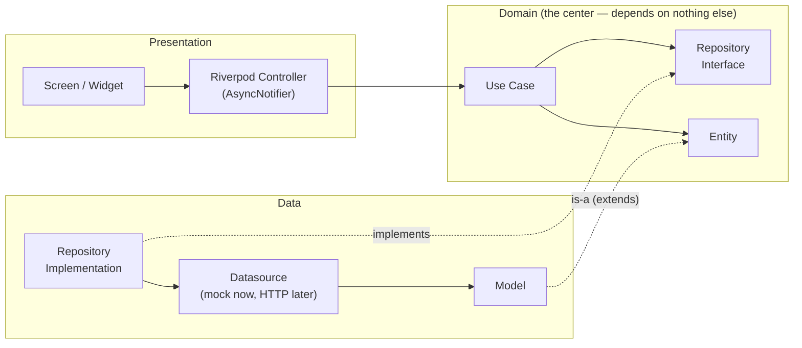
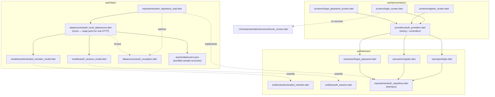
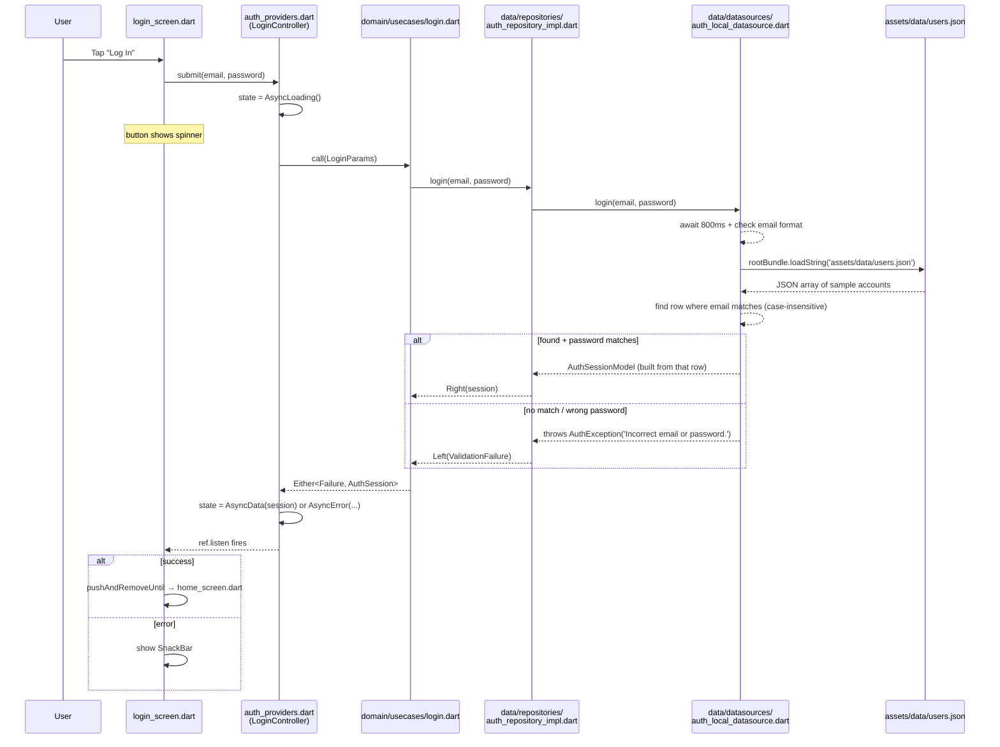
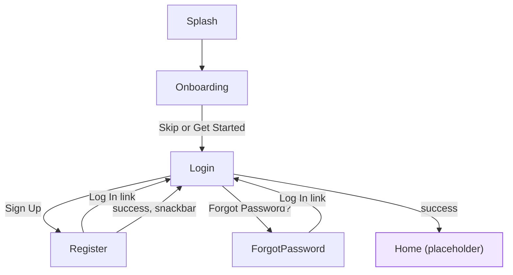

# Libra — Architecture Reference

A living doc explaining **how** the pieces we've built actually connect at runtime. `plan.md` tracks what to build next; this tracks how what's already built works, updated each time a feature gets wired.

---

## 1. The generic pattern (every feature follows this)

Every feature's three layers, and the direction dependencies point — always inward, toward `domain`. `domain` never imports from `data` or `presentation`.

**Why the arrow from `RepoImpl` to `RepoInterface` is dotted ("implements")**: this is the one inversion that makes the whole thing swappable. `domain` defines *what* operations exist (the interface); `data` decides *how* to fulfill them. Swapping the mock datasource for real HTTP later means editing `data/`, never `domain/` or `presentation/`.

---

## 2. Feature: `auth` (built)

### Files involved, and what each one does

| File | Layer | Job |
|---|---|---|
| [`domain/entities/authenticated_member.dart`](lib/features/auth/domain/entities/authenticated_member.dart) | domain | `AuthenticatedMember` — pure data class (id, fullName, email only) |
| [`domain/entities/auth_session.dart`](lib/features/auth/domain/entities/auth_session.dart) | domain | `AuthSession` — tokens + `AuthenticatedMember` |
| [`domain/repositories/auth_repository.dart`](lib/features/auth/domain/repositories/auth_repository.dart) | domain | `AuthRepository` — the interface/contract; declares `login`/`register`/`forgotPassword`, no implementation |
| [`domain/usecases/login.dart`](lib/features/auth/domain/usecases/login.dart) | domain | `Login` — calls `repository.login(...)`, nothing else |
| [`domain/usecases/register.dart`](lib/features/auth/domain/usecases/register.dart) | domain | `Register` — calls `repository.register(...)` |
| [`domain/usecases/forgot_password.dart`](lib/features/auth/domain/usecases/forgot_password.dart) | domain | `ForgotPassword` — calls `repository.forgotPassword(...)` |
| [`data/models/authenticated_member_model.dart`](lib/features/auth/data/models/authenticated_member_model.dart) | data | `AuthenticatedMemberModel extends AuthenticatedMember` — adds `fromJson` |
| [`data/models/auth_session_model.dart`](lib/features/auth/data/models/auth_session_model.dart) | data | `AuthSessionModel extends AuthSession` — adds `fromJson` |
| [`data/datasources/auth_exception.dart`](lib/features/auth/data/datasources/auth_exception.dart) | data | `AuthException` — thrown by the datasource, caught by the repository |
| [`data/datasources/auth_local_datasource.dart`](lib/features/auth/data/datasources/auth_local_datasource.dart) | data | `AuthLocalDatasourceImpl` — **the mock**. Reads `assets/data/users.json`, checks email+password against it, simulates an 800ms delay. This is the one file that gets replaced by a real HTTP datasource later |
| [`assets/data/users.json`](assets/data/users.json) | data (asset, not code) | Sample accounts `AuthLocalDatasourceImpl` reads and matches against — same pattern as `CleanArchitectureDemo`'s `assets/data/books.json` |
| [`data/repositories/auth_repository_impl.dart`](lib/features/auth/data/repositories/auth_repository_impl.dart) | data | `AuthRepositoryImpl implements AuthRepository` — calls the datasource, catches `AuthException`, converts to `Failure` |
| [`presentation/providers/auth_providers.dart`](lib/features/auth/presentation/providers/auth_providers.dart) | presentation | Wires datasource → repository → use cases (`Provider`s), plus `LoginController`/`RegisterController`/`ForgotPasswordController` (`AsyncNotifier`s) that screens actually talk to |
| [`presentation/screens/login_screen.dart`](lib/features/auth/presentation/screens/login_screen.dart) | presentation | UI — calls `loginControllerProvider`, reacts to its state |
| [`presentation/screens/register_screen.dart`](lib/features/auth/presentation/screens/register_screen.dart) | presentation | UI — calls `registerControllerProvider` |
| [`presentation/screens/forgot_password_screen.dart`](lib/features/auth/presentation/screens/forgot_password_screen.dart) | presentation | UI — calls `forgotPasswordControllerProvider` |
| [`features/home/presentation/screens/home_screen.dart`](lib/features/home/presentation/screens/home_screen.dart) | (different feature) | Placeholder landing screen after successful login |

### Structure — same info, as a diagram

### Runtime flow — tapping "Log In" (current behavior, JSON-backed)

Register and Forgot Password follow the identical shape (`RegisterController`, `ForgotPasswordController`) — only what happens on success differs: Register also reads `users.json` to reject a clashing email, then pops back to Login with a snackbar (no auto-login, per the backend contract); Forgot Password shows the generic confirmation and stays put (anti-enumeration rule), no JSON lookup involved.

---

## 3. Screen navigation flow (built so far)

`Splash → Onboarding → Login` and `Login → Home` use `pushReplacement`/`pushAndRemoveUntil` (one-way, can't navigate back). `Login ↔ Register` and `Login ↔ ForgotPassword` use `push`/`pop` (siblings — legitimately reversible). See [plan.md §8-9](plan.md) for why.

---

## 4. Decisions log

**2026-09-09 — Entities are per-feature, not shared.** `auth`'s `AuthenticatedMember` (id, fullName, email) is intentionally a different class from what the future `members` feature will use for the full profile — they represent different bounded contexts (authenticated identity vs. editable profile) even though the fields overlap. Same plan for `books`' full `Book` vs. `borrowings`' tiny embedded `BorrowingBook` — matches how the backend itself scopes each endpoint's response.

**2026-09-09 — `Member` renamed to `AuthenticatedMember`, and dropped the unused `phoneNumber` field.** Per review feedback: a generically-named `Member` inside `auth` risks colliding (in meaning, not compile error — an IDE auto-import trap) with whatever the future `members` feature calls its own entity. The name now encodes the scope directly. Also dropped `phoneNumber` from the entity — it was populated on login but never read by any consumer (verified via grep); `Register`'s own `phoneNumber` request field is unrelated and untouched.

Worth knowing: this follows the *community* Clean Architecture pattern (same as `CleanArchitectureDemo`, our reference repo) — Google's own [official architecture guide](https://docs.flutter.dev/app-architecture/guide) actually recommends the opposite (one shared `domain/models/` folder, repositories kept independent of *each other* but not of the model). We're deliberately staying consistent with `CleanArchitectureDemo` since that's our chosen reference; flagged here in case that tradeoff needs revisiting later.

**2026-09-09 — `auth_local_datasource.dart` checks real sample credentials, not "anything valid-looking succeeds."** Added `assets/data/users.json` (2 sample accounts) so Login actually rejects wrong passwords/unknown emails instead of accepting any 6+ character password. Register checks the same file for an email clash. Matches `CleanArchitectureDemo`'s `assets/data/books.json` pattern exactly, with one deviation: sample rows are read as raw `Map<String, dynamic>`, not mapped through a dedicated `fromJson` model DTO, since the row's `password` field has no home in the domain `AuthenticatedMember` entity.

---

## How to keep this updated

Each time a new feature gets wired (domain + data + presentation, not just UI screens):
1. Add a `## Feature: <name>` section with its structure diagram (copy §2's shape).
2. Add a sequence diagram for its main action if the flow differs meaningfully from `auth`'s.
3. Extend the navigation flowchart in §3 if it adds new screens/transitions.
4. Log any non-obvious architectural decision in §4, dated.
