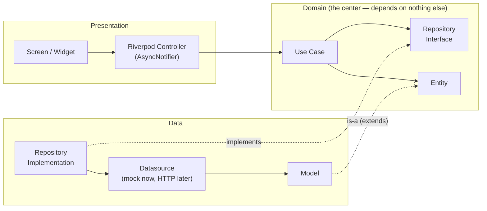
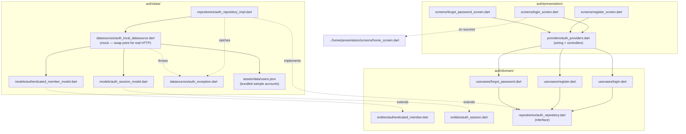
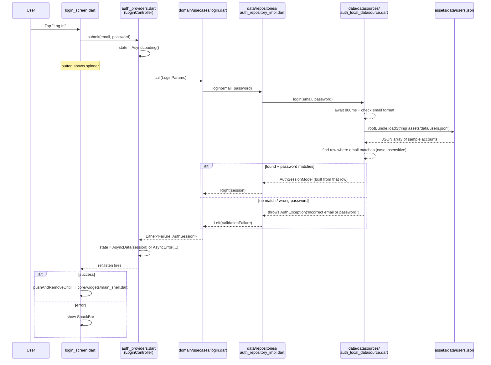
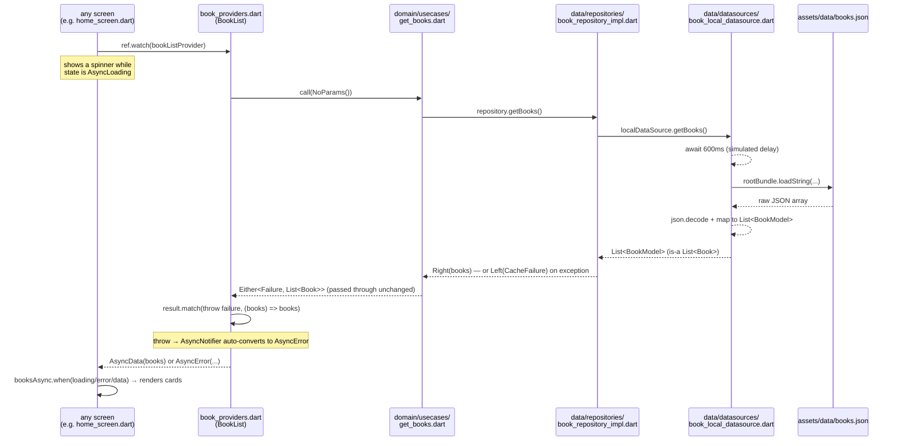
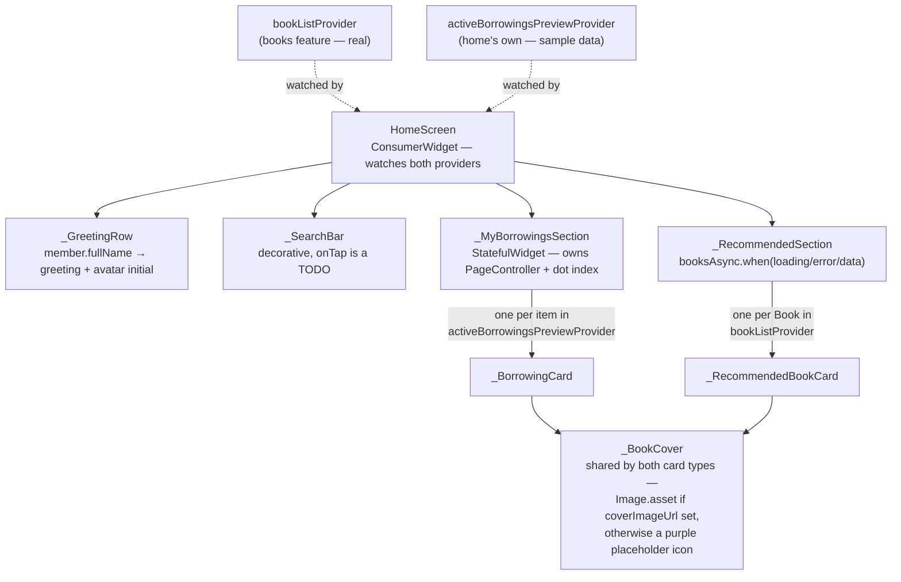
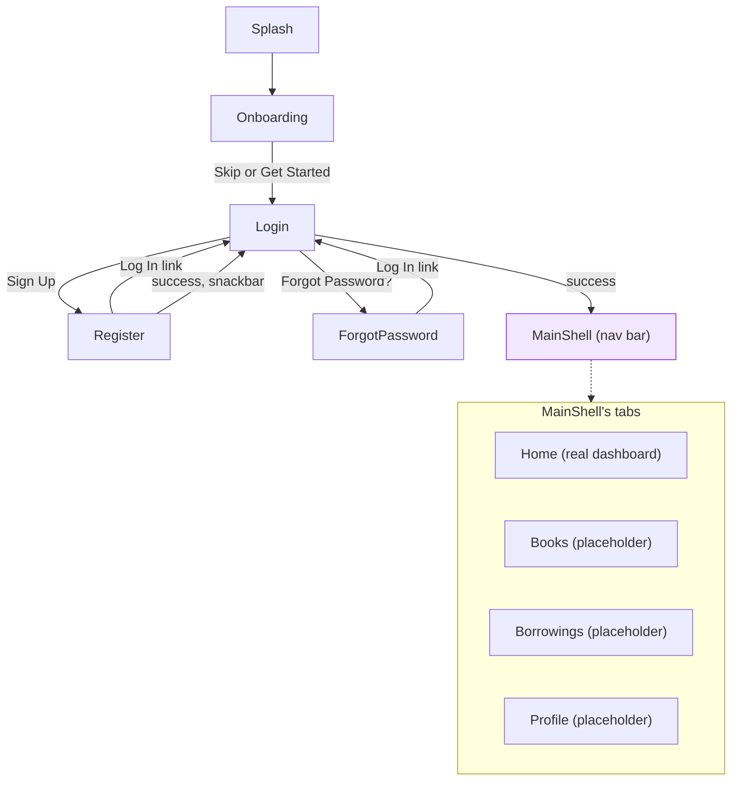

# Libra — Architecture Reference

A living doc explaining **how** the pieces we've built actually connect at runtime. `plan.md` tracks what to build next; this tracks how what's already built works, updated each time a feature gets wired.

---

## 1. The generic pattern (every feature follows this)

Every feature's three layers, and the direction dependencies point — always inward, toward `domain`. `domain` never imports from `data` or `presentation`.

**Why the arrow from `RepoImpl` to `RepoInterface` is dotted ("implements")**: this is the one inversion that makes the whole thing swappable. `domain` defines *what* operations exist (the interface); `data` decides *how* to fulfill them. Swapping the mock datasource for real HTTP later means editing `data/`, never `domain/` or `presentation/`.

---

## 2. Feature: `auth` (built)

### Files involved, and what each one does

| File | Layer | Job |
|---|---|---|
| [`domain/entities/authenticated_member.dart`](lib/features/auth/domain/entities/authenticated_member.dart) | domain | `AuthenticatedMember` — pure data class (id, fullName, email only) |
| [`domain/entities/auth_session.dart`](lib/features/auth/domain/entities/auth_session.dart) | domain | `AuthSession` — tokens + `AuthenticatedMember` |
| [`domain/repositories/auth_repository.dart`](lib/features/auth/domain/repositories/auth_repository.dart) | domain | `AuthRepository` — the interface/contract; declares `login`/`register`/`forgotPassword`, no implementation |
| [`domain/usecases/login.dart`](lib/features/auth/domain/usecases/login.dart) | domain | `Login` — calls `repository.login(...)`, nothing else |
| [`domain/usecases/register.dart`](lib/features/auth/domain/usecases/register.dart) | domain | `Register` — calls `repository.register(...)` |
| [`domain/usecases/forgot_password.dart`](lib/features/auth/domain/usecases/forgot_password.dart) | domain | `ForgotPassword` — calls `repository.forgotPassword(...)` |
| [`data/models/authenticated_member_model.dart`](lib/features/auth/data/models/authenticated_member_model.dart) | data | `AuthenticatedMemberModel extends AuthenticatedMember` — adds `fromJson` |
| [`data/models/auth_session_model.dart`](lib/features/auth/data/models/auth_session_model.dart) | data | `AuthSessionModel extends AuthSession` — adds `fromJson` |
| [`data/datasources/auth_exception.dart`](lib/features/auth/data/datasources/auth_exception.dart) | data | `AuthException` — thrown by the datasource, caught by the repository |
| [`data/datasources/auth_local_datasource.dart`](lib/features/auth/data/datasources/auth_local_datasource.dart) | data | `AuthLocalDatasourceImpl` — **the mock**. Reads `assets/data/users.json`, checks email+password against it, simulates an 800ms delay. This is the one file that gets replaced by a real HTTP datasource later |
| [`assets/data/users.json`](assets/data/users.json) | data (asset, not code) | Sample accounts `AuthLocalDatasourceImpl` reads and matches against — same pattern as `CleanArchitectureDemo`'s `assets/data/books.json` |
| [`data/repositories/auth_repository_impl.dart`](lib/features/auth/data/repositories/auth_repository_impl.dart) | data | `AuthRepositoryImpl implements AuthRepository` — calls the datasource, catches `AuthException`, converts to `Failure` |
| [`presentation/providers/auth_providers.dart`](lib/features/auth/presentation/providers/auth_providers.dart) | presentation | Wires datasource → repository → use cases (`Provider`s), plus `LoginController`/`RegisterController`/`ForgotPasswordController` (`AsyncNotifier`s) that screens actually talk to |
| [`presentation/screens/login_screen.dart`](lib/features/auth/presentation/screens/login_screen.dart) | presentation | UI — calls `loginControllerProvider`, reacts to its state |
| [`presentation/screens/register_screen.dart`](lib/features/auth/presentation/screens/register_screen.dart) | presentation | UI — calls `registerControllerProvider` |
| [`presentation/screens/forgot_password_screen.dart`](lib/features/auth/presentation/screens/forgot_password_screen.dart) | presentation | UI — calls `forgotPasswordControllerProvider` |
| [`features/home/presentation/screens/home_screen.dart`](lib/features/home/presentation/screens/home_screen.dart) | (different feature) | Placeholder landing screen after successful login |

### Structure — same info, as a diagram

### Runtime flow — tapping "Log In" (current behavior, JSON-backed)

Register and Forgot Password follow the identical shape (`RegisterController`, `ForgotPasswordController`) — only what happens on success differs: Register also reads `users.json` to reject a clashing email, then pops back to Login with a snackbar (no auto-login, per the backend contract); Forgot Password shows the generic confirmation and stays put (anti-enumeration rule), no JSON lookup involved.

---

## 3. Feature: `books` (built)

| File | Layer | Job |
|---|---|---|
| [`domain/entities/book.dart`](lib/features/books/domain/entities/book.dart) | domain | `Book` — full catalog shape (id, title, author, isbn, publishedYear, totalCopies, availableCopies, nullable description/coverImageUrl) |
| [`domain/repositories/book_repository.dart`](lib/features/books/domain/repositories/book_repository.dart) | domain | `BookRepository` — interface, `getBooks()` |
| [`domain/usecases/get_books.dart`](lib/features/books/domain/usecases/get_books.dart) | domain | `GetBooks` — calls `repository.getBooks()`, nothing else |
| [`data/models/book_model.dart`](lib/features/books/data/models/book_model.dart) | data | `BookModel extends Book`, adds `fromJson` |
| [`data/datasources/book_local_datasource.dart`](lib/features/books/data/datasources/book_local_datasource.dart) | data | Mock — reads `assets/data/books.json`. Swap point for real `GET /api/books` later |
| [`assets/data/books.json`](assets/data/books.json) | data (asset) | 6 sample books — same pattern as `CleanArchitectureDemo`'s `assets/data/books.json`, and as `auth`'s `users.json` |
| [`data/repositories/book_repository_impl.dart`](lib/features/books/data/repositories/book_repository_impl.dart) | data | Catches datasource exceptions, converts to `Failure` |
| [`presentation/providers/book_providers.dart`](lib/features/books/presentation/providers/book_providers.dart) + generated `.g.dart` | presentation | Codegen (`@riverpod`) — wires datasource → repository → usecase, exposes `bookListProvider` (`AsyncNotifier<List<Book>>`) |
| [`presentation/widgets/book_card.dart`](lib/features/books/presentation/widgets/book_card.dart) | presentation | `BookCard` — shared between the Books grid and Home's Recommended row (`showAvailability` toggles the chip) |

This mirrors `CleanArchitectureDemo`'s own `book` feature almost file-for-file — the closest parity of anything built so far, since that demo's entire purpose is this exact feature. Only real deviation: `id` is `String` (matches our backend contract's UUID shape) instead of the demo's `int`.

No dedicated Books *screen* yet (grid/search/filter chips, design doc §30) — `bookListProvider` currently only feeds Home's Recommended row. Building the Books tab screen is just UI work against a provider that already exists and works.

### Runtime flow — `ref.watch(bookListProvider)`

Every arrow here only ever points toward `domain` (same rule as `auth`'s trace, §2) — `GetBooks` never knows JSON exists, `BookLocalDatasourceImpl` never knows Riverpod exists.

## 4. Feature: `home` dashboard (built)

Real dashboard, not a placeholder — greeting, search bar (decorative for now, no destination), a "My Borrowings" carousel, and a "Recommended" row backed by the real `books` feature.

**Key design decision — `home` owns a small local model for the borrowings preview, not a shared `Borrowing` entity:**

| File | Job |
|---|---|
| [`presentation/models/active_borrowing_preview.dart`](lib/features/home/presentation/models/active_borrowing_preview.dart) | `ActiveBorrowingPreview` — `home`'s own minimal view (title, author, daysLeft, computed progress). Not imported from anywhere, since the `borrowings` feature doesn't exist yet |
| [`presentation/providers/home_providers.dart`](lib/features/home/presentation/providers/home_providers.dart) | `activeBorrowingsPreviewProvider` — sample data *routed through a provider*, not hardcoded in the widget, so swapping in the real `borrowings` feature later is a provider change, not a screen rewrite |
| [`presentation/screens/home_screen.dart`](lib/features/home/presentation/screens/home_screen.dart) | `ConsumerWidget` — watches `activeBorrowingsPreviewProvider` and the real `bookListProvider` side by side |

This is the same "small, feature-scoped model, not a shared entity" call as `auth`'s `AuthenticatedMember` (§2, decisions log) — applied here because the thing it would otherwise depend on (`borrowings`) doesn't exist yet, not because of any dislike of sharing in general.

The dot-page-indicator under the borrowings carousel duplicates the small widget already written for onboarding (`onboarding_screen.dart`) — flagged, not yet extracted to `core/widgets/`, since two occurrences isn't quite enough to justify it yet; worth doing on a third use.

### How the dots actually connect

`home_screen.dart` is one file, but it's built from several private widgets (all in that same file) composed together. This shows which data feeds which widget:

Two things worth noticing from this diagram alone: (1) `_BookCover` is genuinely shared *within* `home_screen.dart` by both card types (not duplicated — this is the "small, stable, same-meaning" case from the Member/Book sharing discussion, just at the widget level instead of the entity level), and (2) `member` (the logged-in user) only flows into `_GreetingRow` — nothing else on this screen touches it.

---

## 5. Screen navigation flow (built so far)

`Splash → Onboarding → Login` and `Login → MainShell` use `pushReplacement`/`pushAndRemoveUntil` (one-way, can't navigate back). `Login ↔ Register` and `Login ↔ ForgotPassword` use `push`/`pop` (siblings — legitimately reversible). See [plan.md §8-9](plan.md) for why. Once inside `MainShell`, switching tabs is just an `IndexedStack` index change — no `Navigator` involved, no back-stack entries created.

---

## 6. Decisions log

**2026-09-09 — Entities are per-feature, not shared.** `auth`'s `AuthenticatedMember` (id, fullName, email) is intentionally a different class from what the future `members` feature will use for the full profile — they represent different bounded contexts (authenticated identity vs. editable profile) even though the fields overlap. Same plan for `books`' full `Book` vs. `borrowings`' tiny embedded `BorrowingBook` — matches how the backend itself scopes each endpoint's response.

**2026-09-09 — `Member` renamed to `AuthenticatedMember`, and dropped the unused `phoneNumber` field.** Per review feedback: a generically-named `Member` inside `auth` risks colliding (in meaning, not compile error — an IDE auto-import trap) with whatever the future `members` feature calls its own entity. The name now encodes the scope directly. Also dropped `phoneNumber` from the entity — it was populated on login but never read by any consumer (verified via grep); `Register`'s own `phoneNumber` request field is unrelated and untouched.

Worth knowing: this follows the *community* Clean Architecture pattern (same as `CleanArchitectureDemo`, our reference repo) — Google's own [official architecture guide](https://docs.flutter.dev/app-architecture/guide) actually recommends the opposite (one shared `domain/models/` folder, repositories kept independent of *each other* but not of the model). We're deliberately staying consistent with `CleanArchitectureDemo` since that's our chosen reference; flagged here in case that tradeoff needs revisiting later.

**2026-09-09 — `auth_local_datasource.dart` checks real sample credentials, not "anything valid-looking succeeds."** Added `assets/data/users.json` (2 sample accounts) so Login actually rejects wrong passwords/unknown emails instead of accepting any 6+ character password. Register checks the same file for an email clash. Matches `CleanArchitectureDemo`'s `assets/data/books.json` pattern exactly, with one deviation: sample rows are read as raw `Map<String, dynamic>`, not mapped through a dedicated `fromJson` model DTO, since the row's `password` field has no home in the domain `AuthenticatedMember` entity.

**2026-09-09 — Login/Register/Forgot Password now use `Form` + `TextFormField` + `validator` for client-side checks.** Empty fields, bad email format, short passwords, and confirm-password mismatch are now caught instantly (red inline error text, no network round-trip) before the mock datasource is ever called. Server-style errors ("incorrect email or password," "email already exists") still go through the async flow and show as a `SnackBar`, since those genuinely require the round-trip to know.

**2026-09-09 — Added `core/widgets/main_shell.dart`, the bottom-nav shell.** `IndexedStack` + a nav bar wrapping Home/Books/Borrowings/Profile as tabs (Books/Borrowings/Profile are placeholders until each feature is built). Built *before* Books, deliberately — retrofitting a standalone screen into a tab later is more rework than building the shell first and slotting features in as they land. `login_screen.dart`'s success navigation now targets `MainShell(member: ...)` instead of the bare `HomeScreen`.

**2026-09-09 — Bottom nav uses `NavigationBar`/`NavigationDestination` (Material 3), not `BottomNavigationBar`.** The shell was originally built with the legacy M2-era `BottomNavigationBar` despite the app having `useMaterial3: true` set — `useMaterial3` doesn't force M3 versions of every widget, it just enables M3 defaults for whichever widget you pick, and the legacy one was picked by mistake. Switched to `NavigationBar` (the actual M3 widget, pill-shaped selection indicator) and added the matching `navigationBarTheme` to `app_theme.dart` (`bottomNavigationBarTheme`, which doesn't apply to `NavigationBar` at all, was removed as dead config). Indicator color uses the existing `AppColors.primarySoft` token rather than inventing a new one.

**2026-09-09 — FVM pin bumped to Flutter 3.47.2 (Dart 3.13.2), latest stable.** Per explicit instruction to always track latest stable going forward. `.fvm` now uses fvm's newer versioned-path layout (`.fvm/versions/3.47.2`) rather than the older single `flutter_sdk` symlink — check `.fvmrc` for whatever's currently pinned, since this is expected to keep moving.

**2026-09-09 — Built `books` (full feature) and `home` (real dashboard) together, not separately.** Originally planned as Books-screen-then-Home, but the actual Home design (§28 in the design doc) needs `books` data for its Recommended row regardless — building Books' domain/data/presentation layers first made the dashboard real instead of another placeholder. The dedicated Books *screen* (grid/search) still doesn't exist; only the data layer + provider does, which the Books screen will consume when built. Home's "My Borrowings" section is still sample data (see §4's `activeBorrowingsPreviewProvider`) since `borrowings` isn't built yet.

**2026-09-09 — Home dashboard sizing fixes, found after comparing against real screenshots.** Greeting row: `crossAxisAlignment` was `start` (icons top-aligned against the two-line greeting) instead of `center`; "Good morning," was regular-weight/secondary-color instead of matching the bold heading size. Borrowing card cover: bumped 56×84 → 80×120, which required bumping the card's fixed height 132 → 160 to avoid overflow. Recommended row: fixed height 210 was short of what a 128-wide, 2:3-aspect cover plus a 2-line title plus an author line actually needs (~261px) — the author line was being clipped, not missing from the code. Bumped to 270.

**2026-09-10 — `auth` and `books` providers migrated from manual Riverpod to codegen (`@riverpod` + `build_runner`).** Prompted by comparing against a friend's independent codebase and re-checking `CleanArchitectureDemo`'s own `future_provider_approach` branch — both use codegen, meaning the earlier manual-provider choice (made to sidestep this machine's Gradle toolchain instability) had actually diverged from our own reference repo, since `build_runner` is pure Dart tooling and was never affected by the Gradle/Java loopback issue in the first place (verified by running it standalone before committing to the migration). `authLocalDataSourceProvider`/`authRepositoryProvider` and `bookLocalDataSourceProvider`/`bookRepositoryProvider` are `@Riverpod(keepAlive: true)` — expensive-ish to recreate, live for the app's lifetime; usecase providers and the `AsyncNotifier` controllers stay plain `@riverpod` (default autoDispose) — cheap to recreate, matching the friend's code's own lifecycle split. Provider *names* were kept identical to the manual versions on purpose, so no screen needed to change — the migration is fully contained to the two provider files plus their generated `.g.dart` counterparts. Workflow change worth remembering: any edit to a `@riverpod`-annotated file now requires `dart run build_runner build` (or `watch` mode) before it compiles again — hot reload alone isn't enough.

**2026-09-10 — Extracted `BookCover` (→ `core/widgets/`) and `BookCard` (→ `books/presentation/widgets/`), replacing three near-duplicate private widgets.** `home_screen.dart` had its own `_BookCover` + `_RecommendedBookCard`, `books_screen.dart` had its own `_BookGridCard` — same cover-or-placeholder logic, same title/author layout, differing only in whether an availability chip was shown. `BookCard` takes a `showAvailability` flag (`true` for the Books grid, `false` for Home's Recommended row) instead of duplicating the layout. `BookCover` went to `core/` rather than `books/` specifically because `home`'s borrowing-preview card needed it too — a genuine cross-feature reuse, not a premature one (same bar as the `Failure`/`UseCase` sharing in §1, applied to a widget instead of a domain type).

**2026-09-10 — Added `AppEmptyState`/`AppErrorState` to `core/widgets/`, replacing plain `Text(...)` for every loading failure and empty-results case.** Matches design doc §41 (empty states) and §43 (error states — icon, heading, message, action button) instead of ad-hoc text. Wired into `books_screen.dart` (no-results search state, with a "Clear Search" action; failed-fetch state, with Retry via `ref.invalidate(bookListProvider)`) and `home_screen.dart`'s Recommended row (failed-fetch state — `_RecommendedSection` needed an `onRetry` callback threaded in from `HomeScreen`, since it's a plain `StatelessWidget` without its own `ref`).

---

## How to keep this updated

Each time a new feature gets wired (domain + data + presentation, not just UI screens):
1. Add a `## Feature: <name>` section with its structure diagram (copy §2's shape).
2. Add a sequence diagram for its main action if the flow differs meaningfully from `auth`'s.
3. Extend the navigation flowchart in §3 if it adds new screens/transitions.
4. Log any non-obvious architectural decision in §4, dated.
